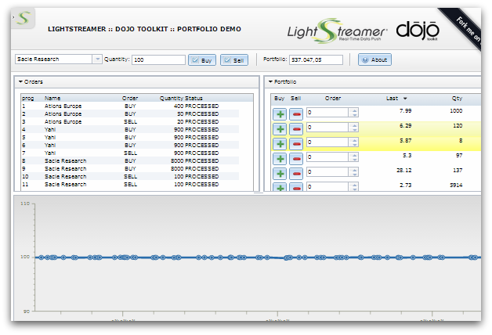

# Lightstreamer - Portfolio Demo - HTML (Dojo Toolkit) Client

<!-- START DESCRIPTION lightstreamer-example-portfolio-client-dojo -->
The *Portfolio Demo* simulate a portfolio management: it shows a list of stocks included in a portfolio and provide a simple order entry form. Changes to portfolio contents, due to new orders, are displayed on the page in real time. In addition to that, the *Full Version of the Portfolio Demo* shows for each stock in the portfolio also the current price, updated in real time from a market data feed.

This project includes a web client front-end for the [Lightstreamer - Portfolio Demo - Java Adapter](https://github.com/Weswit/Lightstreamer-example-Portfolio-adapter-java), showing the integration between the **Dojo Toolkit** and the [Lightstreamer JavaScript Client library](http://www.lightstreamer.com/docs/client_javascript_uni_api/index.html).

## Live Demo

###[ View live demo](http://demos.lightstreamer.com/DojoDemo/portfolio.html)

Real-Time simulated Portfolio data is received from the Lightstreamer Server deployed at [http://push.lightstreamer.com](http://push.lightstreamer.com).

## Details

The demo shows how to use the [Lightstreamer JavaScript Client library](http://www.lightstreamer.com/docs/client_javascript_uni_api/index.html), the [LightstreamerStore 1.0 for Dojo](https://github.com/Weswit/dojo-lightstreamer-store), the [dgrid](https://github.com/SitePen/dgrid) component and [DojoX Charts](https://github.com/dojo/dojox) together.

<!-- END DESCRIPTION lightstreamer-example-portfolio-client-dojo -->

### Known Bugs

*  If the user inputs any value in the dgrid and an update for that rows arrives from the store, the user's value is overwritten.
*  If the user inputs any value and then presses + (to buy) or - (to sell) immediately after, the quantity field appears still empty and the first click fails.

## Install
If you want to install a version of this demo, pointing to your local Lightstreamer Server, follow the steps below.

* As prerequisite, the full version of the [Lightstreamer - Portfolio Demo - Java Adapter](https://github.com/Weswit/Lightstreamer-example-Portfolio-adapter-java) has to be deployed on your local Lightstreamer Server instance. Please follow the [installation instructions for the full version of the *Portfolio Demo*](https://github.com/Weswit/Lightstreamer-example-Portfolio-adapter-java#portfolio-demo).
* Download this project.
* Get the `lightstreamer_namespace.js` file from the `DOCS-SDKs\sdk_client_javascript\alternative_libs` folder of the [latest Lightstreamer distribution](http://www.lightstreamer.com/download) and put it in the `src` folder of the project. Alternatively you can build a `lightstreamer_namespace.js` file from the [online generator](http://www.lightstreamer.com/distros/Lightstreamer_Allegro-Presto-Vivace_5_1_1_Colosseo_20140310/Lightstreamer/DOCS-SDKs/sdk_client_javascript/tools/generator.html). In that case be sure to include the LightstreamerClient, Subscription and StatusWidget modules and to use the "AMD with namespaced names" version.
* Download the [Dojo Toolkit](http://download.dojotoolkit.org) and copy the `dojox` folder from the package to the `src` folder of the project. The demo requires the Dojo Toolkit v.1.8 or higher.
* Using the [CommonJS Package Manager](https://github.com/kriszyp/cpm) install dgrid, dijit and lightstreamer-store in the `src` folder of the project; dependencies for these packages will be automatically resolved by the cpm process:
    * `> cpm install dgrid`
    * `> cpm install dijit`
    * `> cpm install lightstreamer-store`
* Deploy this demo on the Lightstreamer Server (used as Web server) or in any external Web Server. If you choose the former:
    *  create the folders `<LS_HOME>/pages/DojoPortfolio` and copy here the contents of the `/src` folder of this project.
    *  The client demo configuration assumes that Lightstreamer Server, Lightstreamer Adapters and this client are launched on the same machine. If you need to target a different Lightstreamer server, please edit `js/lsClient.js` and change accordingly the line: 
`var lsClient = new LightstreamerClient(protocolToUse+"//localhost:"+portToUse,"FULLPORTFOLIODEMO");`
* Open your browser and point it to: [http://localhost:8080/DojoPortfolio/portfolio.html](http://localhost:8080/DojoPortfolio/portfolio.html)

## Build

It is suggested to compress the dojo/dojox/dijit files in a single js source file to minimize startup times:

Head for the [Dojo Web Builder](http://build.dojotoolkit.org/) and select the following packages:

-  dijit.layout.BorderContainer
-  dijit.Dialog
-  dijit.registry
-  dojox.charting.Chart
-  dojox.charting.StoreSeries
-  dojox.charting.axis2d.Default
-  dojox.charting.plot2d.Default
-  dojox.charting.themes.Claro
-  dijit.form.ToggleButton
-  dojo.store.Memory
-  dojo.store.Observable
-  dojo.parser
-  dojo.domReady
-  dijit.layout.ContentPane
-  dijit.form.Button
-  dojox.collections.Dictionary
-  dojox.collections.ArrayList
-  dojox.gfx.svg
-  dijit.form.NumberTextBox
-  dijit.form.CurrencyTextBox
-  dojo.number
-  dijit.form.NumberSpinner
-  dijit.form.FilteringSelect
-  dijit.form.Button
-  dijit.TitlePane

Then click the "build" button and wait. Once the builder is done a zip file will be dowloaded; copy the files/folders from the archive in the src/dojo foloder and reload the demo. 

## See Also

### Lightstreamer Adapters Needed by This Client 

<!-- START RELATED_ENTRIES -->
* [Lightstreamer - Stock-List Demo - Java Adapter](https://github.com/Weswit/Lightstreamer-example-Stocklist-adapter-java)
* [Lightstreamer - Portfolio Demo - Java Adapter](https://github.com/Weswit/Lightstreamer-example-Portfolio-adapter-java)

<!-- END RELATED_ENTRIES -->

### Related Projects

* [Lightstreamer - StockList Demo - Dojo Toolkit Client](https://github.com/Weswit/Lightstreamer-example-StockList-client-dojo)
* [Lightstreamer - Portfolio Demos - HTML Clients](https://github.com/Weswit/Lightstreamer-example-Portfolio-client-javascript)
* [Lightstreamer - Portfolio Demo - Flex Client](https://github.com/Weswit/Lightstreamer-example-Portfolio-client-flex)
* [LightstreamerStore for Dojo](https://github.com/Weswit/dojo-lightstreamer-store)

## Lightstreamer Compatibility Notes 

* Compatible with Lightstreamer JavaScript Client library version 6.0 or newer.
* Compatible with Dojo Toolkit v.1.8 or newer.
