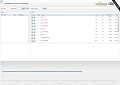

# Lightstreamer - Portfolio Demo - Dojo Toolkit Client #

A simple portfolio demo application showing integration between the Dojo Toolkit and the Lightstreamer JavaScript Client library.

<table>
  <tr>
    <td style="text-align: left">
      &nbsp;<a href="http://demos.lightstreamer.com/DojoDemo/portfolio.html" target="_blank"></a>&nbsp;
      
    </td>
    <td>
      &nbsp;An online demonstration is hosted on our servers at:<br>
      &nbsp;<a href="http://demos.lightstreamer.com/DojoDemo/portfolio.html" target="_blank">http://demos.lightstreamer.com/DojoDemo/portfolio.html</a>
    </td>
  </tr>
</table>

The demo shows how to use the Lightstreamer JavaScript Client library, the [lightstreamer-store](https://github.com/Weswit/dojo-lightstreamer-store), the [dgrid](https://github.com/SitePen/dgrid) component and [DojoX Charts](https://github.com/dojo/dojox) together.

Real-Time simulated Portfolio data is received from the Lightstreamer Server deployed @ [http://push.lightstreamer.com](http://push.lightstreamer.com).<br>
To deploy the demo on your own environment follow the below instructions.

# Deploy #

Before you can run the demo some dependencies need to be solved:

-  Get the lightstreamer_namespace.js file from the [latest Lightstreamer distribution](http://www.lightstreamer.com/download) 
   and put it in the src folder of the demo. Alternatively you can build a lightstreamer_namespace.js file from the 
   [online generator](http://www.lightstreamer.com/distros/Lightstreamer_Allegro-Presto-Vivace_5_1_1_Colosseo_20130305/Lightstreamer/DOCS-SDKs/sdk_client_javascript/tools/generator.html).
   In that case be sure to include the LightstreamerClient, Subscription and StatusWidget modules and to use the "AMD with namespaced names" version.
-  Download [the Dojo Toolkit](http://download.dojotoolkit.org) and copy the dojox folder from the package to the src folder of the demo. The demo requires the Dojo Toolkit v.1.8 or higher.
-  Using the [CommonJS Package Manager](https://github.com/kriszyp/cpm) install dgrid, dijit and lightstreamer-store in the src folder;
   dependencies for these packages will be automatically resolved by the cpm process:
        cpm install dgrid
        cpm install dijit
        cpm install lightstreamer-store
        
The demo is now ready to be launched: navigate to src/index.html and enjoy.        
        
Once the demo is working in your environment it is time to deploy it on a web server. 

## Dojo Build ##

Before doing so it is suggested to compress the dojo/dojox/dijit files in a single js source file to minimize startup times:

Head for the [Dojo Web Builder](http://build.dojotoolkit.org/) and select the following packages:

-  dijit.layout.BorderContainer
-  dijit.Dialog
-  dijit.registry
-  dojox.charting.Chart
-  dojox.charting.StoreSeries
-  dojox.charting.axis2d.Default
-  dojox.charting.plot2d.Default
-  dojox.charting.themes.Claro
-  dijit.form.ToggleButton
-  dojo.store.Memory
-  dojo.store.Observable
-  dojo.parser
-  dojo.domReady
-  dijit.layout.ContentPane
-  dijit.form.Button
-  dojox.collections.Dictionary
-  dojox.collections.ArrayList
-  dojox.gfx.svg
-  dijit.form.NumberTextBox
-  dijit.form.CurrencyTextBox
-  dojo.number
-  dijit.form.NumberSpinner
-  dijit.form.FilteringSelect
-  dijit.form.Button
-  dijit.TitlePane

Then click the "build" button and wait. Once the builder is done a zip file will be dowloaded; copy the files/folders from the archive in the src/dojo foloder and reload the demo. 

## Point to your Lightstreamer ##

The demo currently connects to an online Lightstreamer demo server to get the stock data. It is possible to change this setting making the demo point to a different server. Obviously in this 
case the DEMO adapter needs to be installed on the tagert server (currently such adapter is installed by default).
To change the server edit the index.js file and substitute the following line

```js
    var lsClient = new LightstreamerClient("http://push.lightstreamer.com","DEMO");
```

with

```js
    var lsClient = new LightstreamerClient(myServer,"DEMO");
```

where myServer contains the address of the server (comprehending the port if different from the default one).
As an example, to connect to a local server listening on port 8080 use

```js
    var lsClient = new LightstreamerClient("http://localhost:8080","DEMO");
```

## Known Bugs ##

*  If the user inputs any value in the dgrid and an update for that rows arrives from the store, the user's value is overwritten.
*  If the user inputs any value and then presses + (to buy) or - (to sell) immediately after, the quantity field appears still empty and the first click fails.


# See Also #

## Lightstreamer Adapters needed by this demo client ##

* [Lightstreamer - Stock-List Demo - Java Adapter](https://github.com/Weswit/Lightstreamer-example-Stocklist-adapter-java)
* [Lightstreamer - Portfolio Demo - Java Adapter](https://github.com/Weswit/Lightstreamer-example-Portfolio-adapter-java)

## Similar demo clients that may interest you ##

* [Lightstreamer - StockList Demo - Dojo Toolkit Client](https://github.com/Weswit/Lightstreamer-example-StockList-client-dojo)
* [Lightstreamer - Portfolio Demos - HTML Clients](https://github.com/Weswit/Lightstreamer-example-Portfolio-client-javascript)
* [Lightstreamer - Portfolio Demo - Flex Client](https://github.com/Weswit/Lightstreamer-example-Portfolio-client-flex)

## Related projects ##

* [LightstreamerStore for Dojo](https://github.com/Weswit/dojo-lightstreamer-store)

# Lightstreamer Compatibility Notes #

* Compatible with Lightstreamer JavaScript Client library version 6.0 or newer.
* Compatible with Dojo Toolkit v.1.8 or newer.
